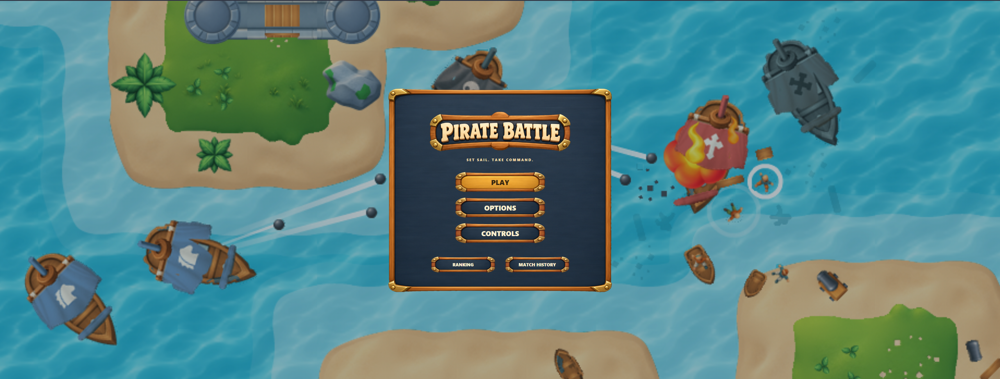
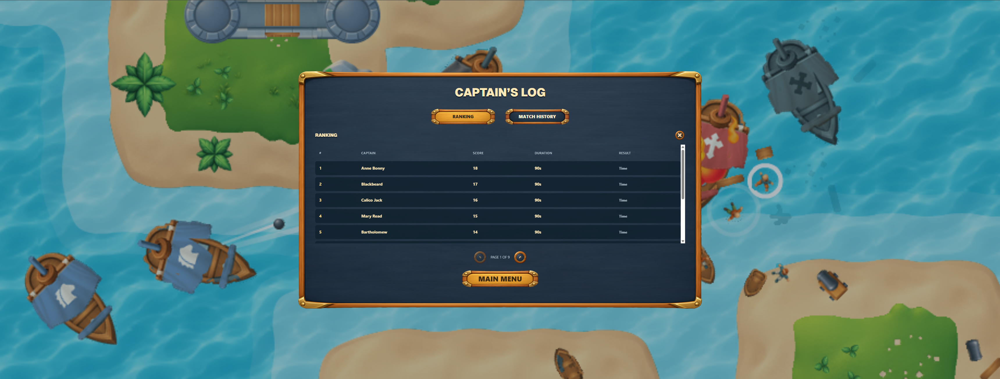
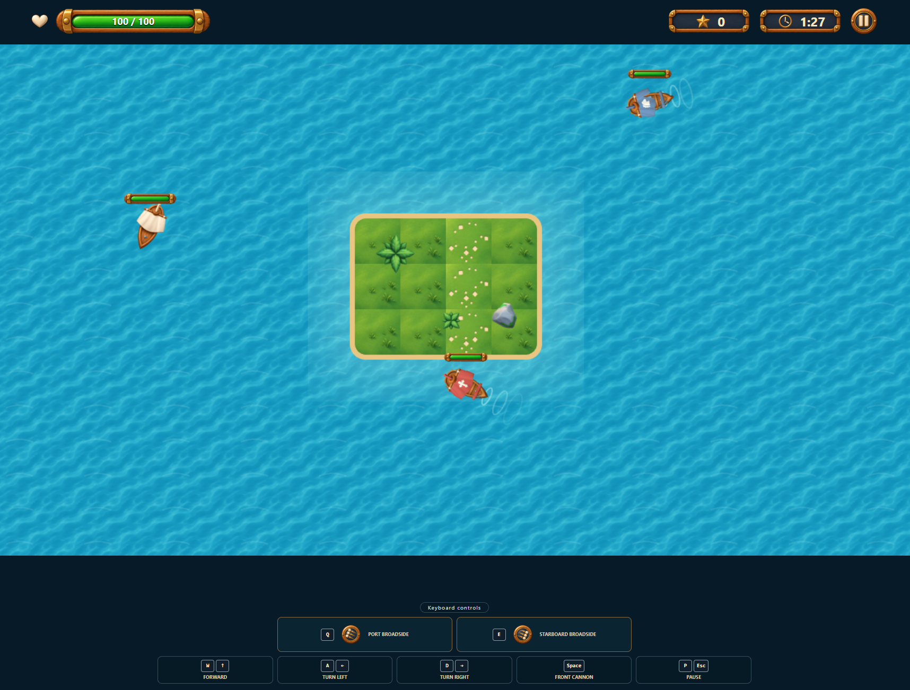
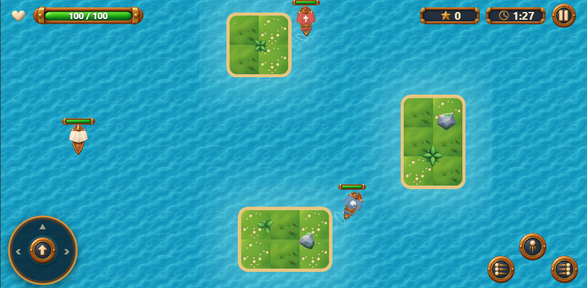
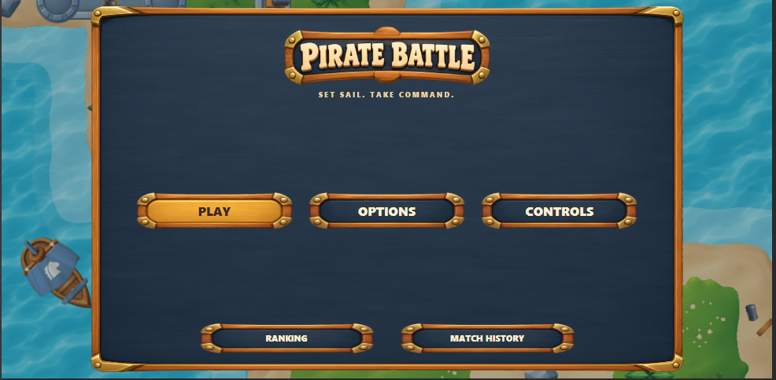
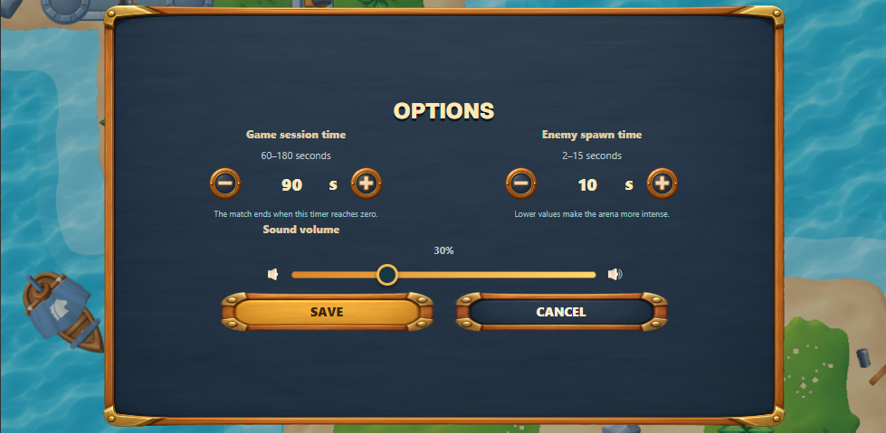

# Pirate Battle

Pirate Battle is a browser-based top-down naval shooter built with React and PixiJS. Sail through randomized island arenas, defeat enemy ships, and survive the match timer.

**Live demo:** [pirate-battle.nkstudios.dev](https://pirate-battle.nkstudios.dev/)

## Highlights

- PixiJS real-time gameplay with delta-time movement and collisions.
- Chaser and shooter enemy behaviors with adjustable difficulty.
- Front cannon and port/starboard broadsides with cooldowns.
- Directional aiming, projectile traces, impact explosions, ship wakes, and shallow-water visuals.
- Randomized arena scenarios with island obstacles and decorations.
- Desktop keyboard controls and landscape mobile joystick/touch controls.
- Main menu, options, controls, pause, result, ranking, and match history screens.
- Loading screen and `READY / SET / SHIP!` match countdown.
- UI, combat, ambience, victory, defeat, and volume-controlled sound effects.
- Local persistence with typed Axios/TanStack Query data flow and MSW fixtures.

## Preview

### Main menu and records





### Gameplay





### Responsive UI





## Controls

| Action | Desktop | Mobile |
| --- | --- | --- |
| Move and steer | `W` / `A` / `D` or arrow keys | Movement joystick |
| Front cannon | Hold and release `Space` | Front-fire button |
| Port broadside | Hold and release `Q` | Port-fire button |
| Starboard broadside | Hold and release `E` | Starboard-fire button |
| Pause | `P` or `Escape` | Pause button |

Broadside indicators rotate with the ship and show the firing direction before release.

## Tech stack

- React 19 + TypeScript
- PixiJS 8
- Vite 8
- Tailwind CSS v4 and local shadcn/ui components
- Motion for interface transitions
- Axios, TanStack Query, and MSW
- Playwright E2E tests

## Getting started

Requirements: Node.js 22+ and npm 10+.

```bash
npm install
cp .env.example .env.local
npm run dev
```

The default setup uses MSW in the browser for ranking and match history. Set `VITE_ENABLE_MOCKS=false` when connecting to a compatible API through `VITE_API_BASE_URL`.

## Useful commands

```bash
npm run dev          # Start the development server
npm run build        # Type-check and build for production
npm run preview      # Preview the production build
npm run lint         # Run ESLint
npm run typecheck    # Run TypeScript checks
npm run test:e2e     # Run desktop and mobile Playwright journeys
```

For the first Playwright run on Ubuntu/WSL, install Chromium and its system dependencies:

```bash
sudo npx playwright install-deps chromium
npx playwright install chromium
```

More detailed delivery and architecture notes are available in [SCOPE.md](SCOPE.md) and [ARCHITECTURE.md](ARCHITECTURE.md).
